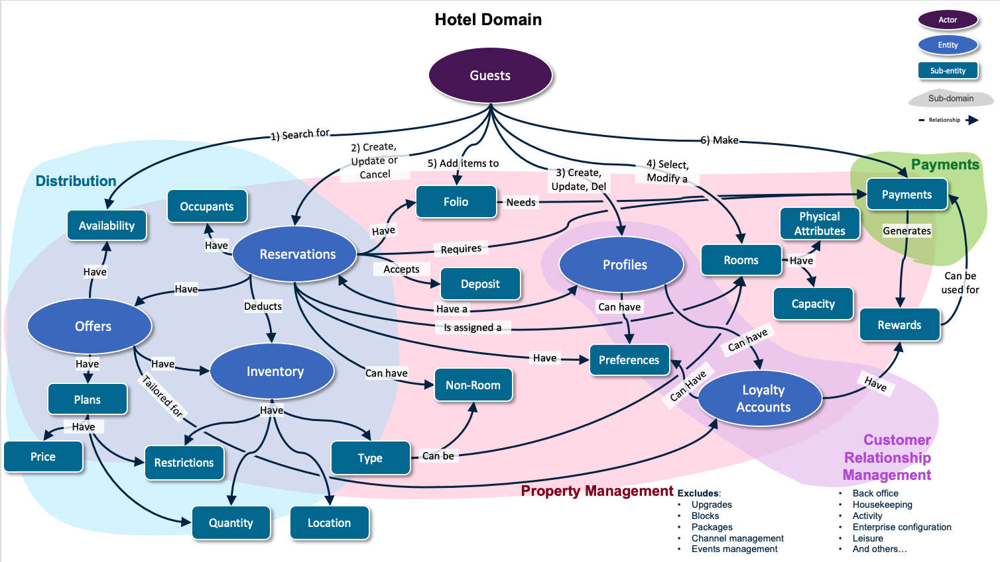

# Domain Models

This folder contains reference domains models that can be used as input / inspiration when defining/modelling new API and API capabilities. This is a living document and expectation is that it will continuously evolve.

## Hotel Domain

This model captures the sub-domains, entities, sub-entities and relationships of the hotel domain including, but not limited to property management, distribution, customer relationship and payments.

> Descriptions of all sub-domains, entities, sub-entities and relationships illustrated in the diagram will be added in due course.
